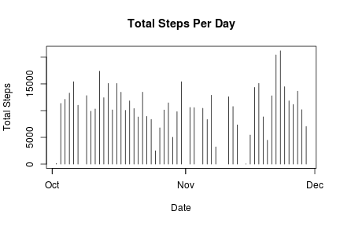
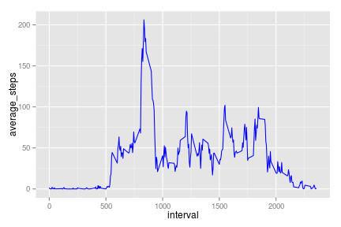
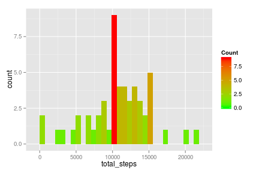

## Loading and preprocessing the data

```r
#Libraries to help with data preprocessing and plotting
library(plyr)
library(dplyr)
library(lubridate)
library(ggplot2)

activity <- read.csv("~/R/RepData_PeerAssessment1/activity.csv")

#Change date from factor to POSIXct
activity<- activity %>% mutate(date=ymd(activity$date))
```


## What is mean total number of steps taken per day?

```r
#Data summarized to report sum, mean and median steps per day
steps_per_day<- na.omit(activity) %>% group_by(date) %>% summarize(sum(steps), mean(steps), median(steps))
names(steps_per_day)<-c("date","total_steps","mean","median")
```


```r
mean(steps_per_day$total_steps)
```

```
## [1] 10766.19
```


```r
median(steps_per_day$steps)
```

```
## Warning in is.na(x): is.na() applied to non-(list or vector) of type
## 'NULL'
```

```
## NULL
```


```r
ggplot(steps_per_day,aes(x=total_steps))+ geom_histogram(aes(fill = ..count..)) + scale_fill_gradient("Count", low = "green", high = "red")
```

```
## stat_bin: binwidth defaulted to range/30. Use 'binwidth = x' to adjust this.
```

 

## What is the average daily activity pattern?

```r
steps_interval<-activity%>%group_by(interval)%>%summarize(mean(steps,na.rm=TRUE))
names(steps_interval)<-c("interval","average_steps")
```


```r
ggplot(data=steps_interval,aes(x=interval,y=average_steps)) + geom_line(color="blue")
```

 

Interval with maximum number of average steps

```r
steps_interval[which.max(steps_interval$average_steps),]$interval
```

```
## [1] 835
```

## Imputing missing values

Total missing values

```r
sum(is.na(activity$steps))
```

```
## [1] 2304
```

Missing values imputed by substituting for average steps for interval

```r
steps_for_interval<-function(interval){
    steps_interval[steps_interval$interval==interval,]$steps
}
```

New data set with missing values filled

```r
new_activity<-activity
count=0
for(i in 1:nrow(new_activity)){
    if(is.na(new_activity[i,]$steps)){
        new_activity[i,]$steps<-steps_for_interval(new_activity[i,]$interval)
        count=count+1
    }
}
```

```
## Error in as.POSIXct.numeric(value): 'origin' must be supplied
```

```r
cat("Total ",count, "NA values were filled")  
```

```
## Total  0 NA values were filled
```

Histogram of new activity data

```r
#Data summarized to report sum, mean and median steps per day
steps_per_day2<- new_activity %>% group_by(date) %>% summarize(sum(steps), mean(steps), median(steps))
names(steps_per_day2)<-c("date","total_steps","mean","median")
```


```r
mean(steps_per_day2$total_steps)
```

```
## [1] NA
```


```r
median(steps_per_day2$steps)
```

```
## Warning in is.na(x): is.na() applied to non-(list or vector) of type
## 'NULL'
```

```
## NULL
```


```r
ggplot(steps_per_day2,aes(x=total_steps)) + geom_histogram(aes(fill = ..count..)) + scale_fill_gradient("Count", low = "green", high = "red")
```

```
## stat_bin: binwidth defaulted to range/30. Use 'binwidth = x' to adjust this.
```

 

## Are there differences in activity patterns between weekdays and weekends?
